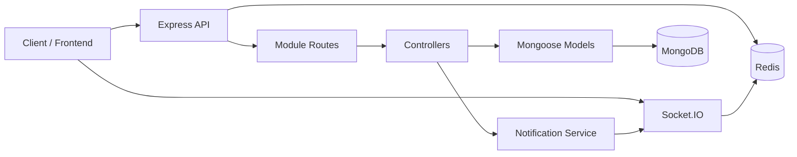

# Hi Devs Backend


A production-ready TypeScript backend for the Hi Devs platform. It powers authentication, user profiles, questions, blogs, comments, jobs, job applications, notifications, rate limiting, Swagger documentation, and realtime notification delivery.

## Table of Contents

- [Features](#features)
- [Tech Stack](#tech-stack)
- [Architecture](#architecture)
- [Getting Started](#getting-started)
- [Environment Variables](#environment-variables)
- [Available Scripts](#available-scripts)
- [API Modules](#api-modules)
- [Realtime Notifications](#realtime-notifications)
- [Testing](#testing)
- [Docker](#docker)
- [Project Structure](#project-structure)
- [Development Notes](#development-notes)
- [License](#license)

## Features

- JWT authentication with access and refresh token rotation
- Redis-backed refresh token storage
- User profile management with searchable user listing
- Questions, blogs, comments, and likes
- Job posting, job discovery, owner-only job updates, and automatic expiry handling
- Job application workflow with applicant and job-owner authorization checks
- MongoDB-backed notifications with Redis-cached unread counts
- Socket.IO realtime notification delivery
- Global API rate limiting with Redis support
- Request validation with Zod
- Pagination helper for list endpoints
- Swagger API documentation
- Vitest and Supertest test coverage
- Docker and Docker Compose support

## Tech Stack

| Area                   | Technology                 |
| ---------------------- | -------------------------- |
| Runtime                | Node.js                    |
| Language               | TypeScript                 |
| Web framework          | Express 5                  |
| Database               | MongoDB with Mongoose      |
| Cache / realtime state | Redis with ioredis         |
| Authentication         | JSON Web Tokens            |
| Validation             | Zod                        |
| Realtime               | Socket.IO                  |
| API docs               | Swagger UI / swagger-jsdoc |
| Testing                | Vitest, Supertest          |
| Build                  | TypeScript, SWC            |
| Linting / formatting   | ESLint, Prettier           |

## Architecture

The application is organized by feature modules under `src/module`. Each module owns its route, controller, model, and validation schema.



Primary entry points:

- `src/app.ts` connects infrastructure, initializes sockets, starts cron jobs, and starts the HTTP server.
- `src/server.ts` builds the Express app and mounts middleware, API routes, and Swagger docs.
- `src/routes/index.ts` registers all feature routers under `/api`.

## Getting Started

### Prerequisites

- Node.js 20+
- npm
- MongoDB
- Redis

### Installation

```bash
npm install
```

### Configure Environment

Create a `.env` file in the project root:

```bash
NODE_ENV=development
PORT=8080
MONGO_URI=mongodb://localhost:27017/hi-devs
JWT_SECRET=replace-with-a-strong-secret
ACCESS_TOKEN_EXPIRES_IN=30
REFRESH_TOKEN_EXPIRES_IN=7
CLIENT_URL=http://localhost:3000
API_RATE_LIMIT_MAX=5000
API_RATE_LIMIT_WINDOW_MS=900000
REDIS_URL=redis://localhost:6379
```

### Run Locally

```bash
npm run dev
```

The API will be available at:

- API: `http://localhost:8080/api`
- Swagger docs: `http://localhost:8080/api-docs`

## Environment Variables

| Variable                   | Required | Default                                | Description                                                            |
| -------------------------- | -------- | -------------------------------------- | ---------------------------------------------------------------------- |
| `NODE_ENV`                 | No       | `production`                           | Runtime environment: `production`, `development`, `staging`, or `test` |
| `PORT`                     | No       | `8080`                                 | HTTP server port                                                       |
| `MONGO_URI`                | No       | `mongodb://localhost:27017/mydatabase` | MongoDB connection string                                              |
| `JWT_SECRET`               | No       | `default-secret-key`                   | Secret used to sign access and refresh tokens                          |
| `ACCESS_TOKEN_EXPIRES_IN`  | No       | `30`                                   | Access token lifetime in minutes                                       |
| `REFRESH_TOKEN_EXPIRES_IN` | No       | `30`                                   | Refresh token lifetime in days                                         |
| `CLIENT_URL`               | No       | `http://localhost:3000`                | Allowed Socket.IO client origin                                        |
| `API_RATE_LIMIT_MAX`       | No       | `5000`                                 | Max requests per rate-limit window                                     |
| `API_RATE_LIMIT_WINDOW_MS` | No       | `900000`                               | Rate-limit window in milliseconds                                      |
| `REDIS_URL`                | No       | `redis://localhost:6379`               | Redis connection string                                                |

For production, always override `JWT_SECRET`, `MONGO_URI`, and `REDIS_URL`.

## Available Scripts

| Command                | Description                                       |
| ---------------------- | ------------------------------------------------- |
| `npm run dev`          | Start the development server with `tsx watch`     |
| `npm run build`        | Type-check, lint, and compile TypeScript with SWC |
| `npm start`            | Start the compiled production server              |
| `npm run lint`         | Run ESLint on `src`                               |
| `npm run format`       | Format source files with Prettier                 |
| `npm test`             | Run the Vitest test suite                         |
| `npm run cli`          | Run the module scaffolding CLI                    |
| `npm run docker:build` | Build Docker services                             |
| `npm run docker:up`    | Start Docker services                             |
| `npm run docker:down`  | Stop Docker services                              |

## API Modules

All API routes are mounted under `/api`.

| Module        | Base Path        | Description                                                 |
| ------------- | ---------------- | ----------------------------------------------------------- |
| Auth          | `/auth`          | Signup, signin, refresh token, logout                       |
| Users         | `/users`         | User listing, profile, profile update, user lookup          |
| Questions     | `/questions`     | Create, list, view, update, delete, and like questions      |
| Blogs         | `/blogs`         | Create, list, view, update, delete, and like blog posts     |
| Comments      | `/comments`      | Comments for blogs/questions/jobs, update, delete, and like |
| Jobs          | `/jobs`          | Job posting, listing, detail, owner updates, user jobs      |
| Applications  | `/applications`  | Apply to jobs, view applications, update application status |
| Notifications | `/notifications` | List, unread count, mark read, mark all read, delete        |

Interactive API documentation is served at `/api-docs`.

## Realtime Notifications

Socket.IO is initialized after the database connection succeeds. Clients authenticate with the same JWT secret used by the HTTP API.

Supported token locations:

- `socket.handshake.auth.token`
- `Authorization: Bearer <token>` header

Authenticated users join a personal room:

```text
user:{userId}
```

Notification events are emitted to that room using the `notification` event.

## Testing

Run the test suite:

```bash
npm test -- --run
```

The tests use Vitest, Supertest, and module mocks for infrastructure such as Redis and MongoDB connection setup.

Current coverage includes:

- Authentication
- Auth middleware
- Users
- Questions
- Blogs
- Comments
- Jobs
- Applications
- Notifications
- Rate limiting
- Swagger docs

## Docker

Build and run with Docker Compose:

```bash
npm run docker:build
npm run docker:up
```

Stop services:

```bash
npm run docker:down
```

## Project Structure

```text
src/
  app.ts                         # Application bootstrap
  server.ts                      # Express app setup
  routes/                        # API router registry
  config/                        # Env, Redis, Socket.IO, Swagger, logger
  database/                      # MongoDB connection
  middlewares/                   # Auth, rate limiter, common middleware
  module/
    auth/                        # Signup, signin, refresh token, logout
    user/                        # User profiles and user discovery
    question/                    # Q&A questions
    blog/                        # Blog posts and likes
    comments/                    # Polymorphic comments
    job/                         # Job posts and expiry cron
    applications/                # Job applications
    notification/                # Notification persistence and helpers
  socket/                        # Socket.IO auth and event handlers
  test/                          # Vitest test suite
  utils/                         # Shared helpers
```

## Development Notes

- Prefer adding new features as modules under `src/module/<feature>`.
- Keep request validation in the module-level `*.validation.ts` file.
- Keep database shape in Mongoose models and request shape in Zod schemas.
- Use `catchAsync` for controllers to keep async error handling consistent.
- Use `paginate` for list endpoints that need pagination metadata.
- Protected HTTP routes should use `authMiddleware`.
- Realtime-only features should validate the authenticated `socket.userId`.

## License

This project is licensed under the MIT License. See [LICENSE](LICENSE) for details.
